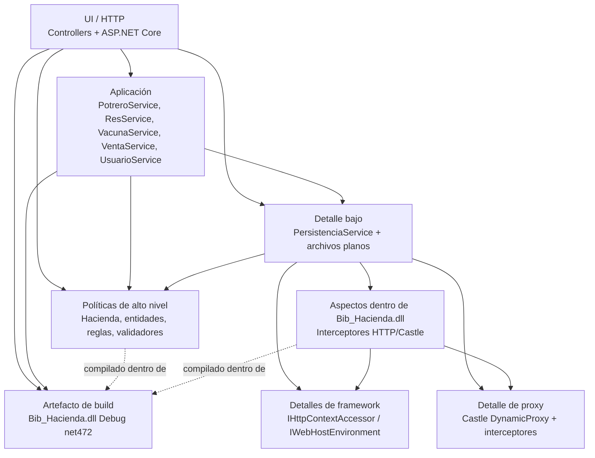

# Diagnóstico AS-IS para comité de presupuesto

**Fecha de corte:** 5 de agosto de 2026  
**Propósito:** sustentar decisiones de presupuesto con evidencia estática del estado actual, sin modificar ni ejecutar producción.  
**Autoría de los hallazgos:** `Asistido` en todos los casos. La sección [Requisito de autoría humana pendiente](#requisito-de-autoría-humana-pendiente) explica cómo convertir tres candidatos en evidencia `Propio` solo después de su reproducción por estudiantes.

## 1. Alcance y baseline

La inspección directa cubrió exclusivamente código productivo y configuración bajo:

- `Bib_Hacienda/Bib_Hacienda`
- `p_mvcHacienda`

Se excluyeron `bin/`, `obj/`, `packages/`, `vendor/`, `.opencode/` y `graphify-out/`. Esas rutas no sustentan ningún hallazgo. No se modificó código productivo ni configuración. Los únicos entregables escritos son este diagnóstico y el diagrama UML AS-IS.

### Baseline verificable

| Comprobación | Resultado | Consecuencia para el diagnóstico |
|---|---|---|
| `command -v dotnet` | Sin salida: `dotnet` ausente | Se omitieron `dotnet restore`, `dotnet build`, `dotnet test` y `dotnet format --verify-no-changes`. |
| `command -v msbuild` | Sin salida: `msbuild` ausente | No fue posible compilar la biblioteca clásica .NET Framework 4.7.2. |
| Soluciones y proyectos | Dos soluciones separadas: `Bib_Hacienda/Bib_Hacienda/Bib_Hacienda.sln` con `Bib_Hacienda.csproj` (`v4.7.2`) y `p_mvcHacienda/p_mvcHacienda.sln` con `p_mvcHacienda.csproj` (`net8.0`) | El estado de compilación es desconocido, no fallido. |
| Pruebas | No se detectaron proyectos ni archivos de prueba; `Tests/` solo está declarado como carpeta vacía en `Bib_Hacienda.csproj:140-142` | No existe una red ejecutable de regresión detectada. |
| Ejecución HTTP | Omitida deliberadamente | No se observaron respuestas `302`, `401`, `403`, concurrencia real ni fallos de E/S; la evidencia HTTP es estática. |

No se atribuye al código ningún fallo de build preexistente: faltan las herramientas para medirlo. Tampoco se ejecutó la aplicación web ni se enviaron solicitudes HTTP.

### Vista UML relacionada

[Abrir `uml-as-is.puml`](./uml-as-is.puml).

El diagrama fue reconstruido desde 50 archivos C# productivos: contiene clases, interfaces, enums, delegates/eventos, miembros, relaciones, multiplicidades y dependencias técnicas observadas. Su sintaxis fue validada con `java -jar /tmp/opencode/plantuml.jar -checkonly` (PlantUML 1.2025.4, código 0). No se generó SVG porque Graphviz `dot` no está instalado.

## 2. Resumen ejecutivo

Se confirman nueve condiciones estructurales por inspección estática; los incidentes runtime y su frecuencia no fueron reproducidos. Las dos primeras exponen el mayor riesgo presupuestario inmediato: el sistema emite una cookie de autenticación, pero la mayoría de las rutas de negocio no exige autorización; además, conserva y compara contraseñas recuperables. La tercera combina estado global mutable con operaciones lógicas distribuidas entre archivos independientes y publicación posible de una hacienda parcialmente cargada.

El resto explica costo de cambio y riesgo de regresión: el round-trip altera datos válidos; persistencia concentra almacenamiento, validación, HTTP y proxies; algunos controladores eluden servicios; una interfaz promete operaciones que sus implementaciones rechazan; la biblioteca de negocio conoce ASP.NET/Castle; y el proyecto `net8.0` consume una DLL `Debug` de `net472` sin relación de proyecto.

Para presupuesto, la conclusión no es “reescribir”. El gasto debe proteger primero el límite HTTP y las credenciales, y después la integridad del estado. H-04 a H-09 justifican capacidad de estabilización y verificación porque elevan el costo y la incertidumbre de esos cambios. La ausencia de build y tests impide convertir evidencia estática en garantía operativa.

## 3. Inventario consolidado

| ID | Ubicación (archivo / clase / línea) | Síntoma observado | Principio comprometido | Impacto en el negocio | Severidad y origen |
|---|---|---|---|---|---|
| H-01 | `p_mvcHacienda/Program.cs` / `Program` / 14, 17-24, 102-110; `Controllers/HomeController.cs` / `HomeController` / 8; demás controladores en detalle | Autenticación configurada, pero autorización HTTP incompleta y política de permisos desconectada | Seguridad de límite HTTP; arquitectura | Acceso anónimo plausible a consultas y mutaciones por ruta directa | Alta; `Asistido` |
| H-02 | `Servicios/PersistenciaService.cs` / `GuardarUsuarios`, `CargarUsuarios` / 275-289, 602-627; `Bib_Hacienda/.../Usuario.cs` / `Usuario` / 12-21 | Contraseñas recuperables, persistidas y comparadas en texto plano | Seguridad de credenciales | Exposición de credenciales reutilizables ante lectura de archivo, memoria o respaldo | Alta; `Asistido` |
| H-03 | `p_mvcHacienda/Program.cs` / `Main` / 29-87; `PersistenciaService.cs` / guardados / 83, 121, 163, 206, 263, 289; `Controllers/ResController.cs` / `Vender` / 165-169 | Singleton mutable, commit lógico multiarchivo no atómico y posibilidad de inicialización parcial | Arquitectura e integridad transaccional | Riesgo de estado divergente, pérdida de actualización y operación parcialmente confirmada | Alta; `Asistido` |
| H-04 | `PersistenciaService.cs` / `GuardarVacunas`, `CargarVacunas`, `CargarVacunasAplicadas` / 194-206, 492-517, 570-589 | El round-trip pierde atenuación y convierte discriminadores desconocidos en subtipos por defecto | Contrato de serialización; LSP/arquitectura | Datos válidos cambian tras reinicio y corrupción/evolución puede quedar oculta | Alta; `Asistido` |
| H-05 | `PersistenciaService.cs` / clase completa, especialmente 15-57, 62-297, 303-638; servicios / constructores | Una clase mezcla archivos, codec, validación, HTTP y proxies; servicios conocen el concreto | SRP y DIP | Cambios de almacenamiento, reglas, HTTP o proxy impactan el mismo componente y dificultan pruebas | Media-alta; `Asistido` |
| H-06 | `Controllers/ResController.cs` / 13-23, 43-44, 113-116, 165-169; `Controllers/PotreroController.cs` / 76-79 | Controladores saltan servicios y un flujo duplica el guardado | SRP, DIP y límite MVC | Casos de uso fragmentados, doble E/S y respuestas que pueden contradecir el estado persistido | Media-alta; `Asistido` |
| H-07 | `Bib_Hacienda/.../IValidarInformacion.cs` / 11-23; `Clases/Validaciones/Validar*.cs` / 12-33 | Interfaz obliga cuatro operaciones; cada implementación lanza tres `NotImplementedException` | ISP y LSP | Contrato público no sustituible y mayor costo de consumo/mantenimiento | Media; `Asistido` |
| H-08 | `Bib_Hacienda.csproj` / 34-65, 101-102; `Aspectos/InterceptorValidarInformacion.cs` / 1-84; `InterceptorAutenticacion.cs` / 1-69 | Biblioteca de negocio depende de ASP.NET Core y Castle | DIP y límites arquitectónicos | Acoplamiento web dificulta build, reutilización y evolución del target | Alta; `Asistido` |
| H-09 | `p_mvcHacienda.csproj` / 1-17; `Bib_Hacienda.csproj` / 12, 16-20 | Aplicación `net8.0` consume DLL `Debug` de biblioteca `net472` sin `ProjectReference` | Arquitectura de build y trazabilidad | Reproducibilidad en riesgo, binario potencialmente obsoleto y configuraciones desalineadas | Alta; `Asistido` |

## 4. Detalle de causas raíz

### H-01. Autorización HTTP incompleta

**Estado:** confirmado por inspección estática. **Confianza:** alta. **Origen:** `Asistido`.

- **Ubicación exacta:** cookie en `p_mvcHacienda/Program.cs:17-24`; middleware en `Program.cs:102-106`; ruta sin exigencia global en `Program.cs:108-110`; único `[Authorize]` detectado en `Controllers/HomeController.cs:8`. Acciones no protegidas detectadas en `UsuarioController.cs:17,29,37`, `ResController.cs:27,39,65,73,106,132`, `PotreroController.cs:27,39,45,63`, `VacunaController.cs:26,38,45,56,142` y `VentaController.cs:17,28,34,40,46,54,67,80`. La identidad solo recibe nombre en `Servicios/UsuarioService.cs:98-102`.
- **Evidencia:** existe autenticación por cookie, pero no política fallback, `RequireAuthorization` ni atributos de autorización en los controladores de negocio. La matriz admin/empleado/visitante de `Bib_Hacienda/Clases/Autenticacion.cs:123-137` no está registrada ni conectada al pipeline MVC. Además, `ResController.Alimentar` y `Vender` mutan estado en `ResController.cs:106-128,132-180` sin `[HttpPost]` ni antiforgery; el comentario “POST” no restringe el verbo HTTP.
- **Contrato:** toda operación de negocio expuesta por HTTP debe exigir identidad; cuando el dominio declara capacidades diferentes, la solicitud debe comprobar el permiso correspondiente.
- **Cliente:** clientes HTTP anónimos o autenticados, administración de usuarios y operaciones sobre ganado, potreros, vacunas y ventas.
- **Contraevidencia:** `HomeController` sí está protegido; autenticación y middleware están configurados; varias mutaciones usan antiforgery, por ejemplo `UsuarioController.cs:35-36`. Antiforgery limita CSRF, pero no reemplaza autorización. Sin ejecución HTTP, el código demuestra ausencia de barreras declaradas, no una explotación observada.
- **Salvaguarda presupuestaria mínima:** reservar una corrección transversal del límite HTTP, sin rediseñar dominio ni persistencia.
- **Verificación mínima:** pruebas de integración para desafío anónimo, permisos acordados, verbos admitidos y antiforgery en mutaciones.
- **Cruces y trade-off:** reduce la exposición de H-02 y H-06; una barrera global exige declarar cuidadosamente las rutas anónimas de login/acceso denegado.

### H-02. Contraseñas recuperables en texto plano

**Estado:** confirmado. **Confianza:** alta. **Origen:** `Asistido`.

- **Ubicación exacta:** valor mutable en `Bib_Hacienda/Clases/Usuario.cs:12-21`; credenciales hardcodeadas en `Clases/Autenticacion.cs:23-25`; comparación directa en `Autenticacion.cs:71-73` y `p_mvcHacienda/Servicios/UsuarioService.cs:64-65,94`; escritura `nombre|contraseña` en `PersistenciaService.cs:275-289`; lectura directa en `PersistenciaService.cs:602-627`.
- **Evidencia:** no se encontró hasher, sal, PBKDF2, bcrypt, Argon2 ni verificación de hash en el alcance. La contraseña original cruza modelo, servicio y archivo.
- **Contrato:** una credencial persistida no debe ser recuperable; su verificación debe realizarse contra una derivación lenta y salada.
- **Cliente:** `AccountController.Login`, `UsuarioController.Create`, `UsuarioService`, respaldos y todos los usuarios almacenados.
- **Contraevidencia:** los formularios usan input de contraseña, la tabla no muestra el secreto y `Program.cs:92-99` configura HTTPS/HSTS. Esas medidas protegen presentación/transporte, no almacenamiento. La vista `Views/Usuario/Index.cshtml:102-108` incluso afirma almacenamiento seguro, en contradicción con el código.
- **Salvaguarda presupuestaria mínima:** presupuestar formato no recuperable y tratamiento explícito de credenciales existentes; no implica reescribir autenticación completa.
- **Verificación mínima:** comprobar que el archivo no contiene el secreto, que valores iguales no producen material idéntico y que login correcto/incorrecto conserva su contrato.
- **Cruces y trade-off:** H-01 amplía su superficie; cambiar el formato sin política para registros actuales puede bloquear usuarios.

### H-03. Estado singleton mutable, escrituras multiarchivo no atómicas e inicialización parcial

**Estado:** condiciones estructurales confirmadas; manifestaciones concurrentes, pérdida de actualización y fallos intermedios no reproducidos. **Confianza:** alta para la estructura y media para su manifestación runtime. **Origen:** `Asistido`.

- **Ubicación exacta:** singletons en `p_mvcHacienda/Program.cs:29-87`; listas mutables expuestas en `Bib_Hacienda/Clases/Hacienda.cs:19-40`; lista de usuarios `static` en `Servicios/UsuarioService.cs:9,21,40-49`; lazy de proxies sin lock en `PersistenciaService.cs:40-57`; archivos independientes en `PersistenciaService.cs:83,121,163,206,263,289`; venta muta en `Hacienda.cs:156-160` y luego guarda secuencialmente en `ResController.cs:165-169`; carga incremental y captura global en `Program.cs:35-73`.
- **Evidencia:** memoria compartida se modifica antes de completar todos los `File.WriteAllLines`; no se detectaron lock, journal, commit marker, rollback ni reemplazo coordinado. Si una carga falla después de agregar potreros/reses, el `catch` registra y retorna esa misma `Hacienda` parcial. En venta, `ResController.cs:168-169` ignora los textos devueltos por ambos guardados y publica éxito en `171-172`, aunque la validación puede devolver error sin escribir (`PersistenciaService.cs:110-114,147-151`).
- **Contrato:** una operación que cambia varias representaciones del mismo estado debe observarse completamente confirmada o no confirmada; una instancia publicada debe cumplir su política de carga completa.
- **Cliente:** `ResController.Vender/Alimentar`, `VacunaService.AplicarVacuna`, servicios singleton y solicitudes posteriores que leen `Hacienda`/usuarios.
- **Contraevidencia:** cada `WriteAllLines` cierra su archivo; operaciones de un solo archivo tienen menor superficie; todos los servicios del proceso ven el mismo singleton y no hay evidencia de despliegue multiinstancia. La factory de `Hacienda` es diferida: `builder.Build()` no prueba carga eager. El riesgo preciso es **inicialización parcial en la primera resolución**, posiblemente durante una solicitud, no necesariamente en el arranque del proceso.
- **Salvaguarda presupuestaria mínima:** financiar una unidad de confirmación recuperable para venta/vacunación y una política explícita de publicación de carga, no una sustitución total del almacenamiento.
- **Verificación mínima:** fallo inducido entre escrituras, fallo en cada etapa de carga y dos operaciones concurrentes sobre la misma res.
- **Cruces y trade-off:** H-06 dispersa la confirmación; serializar acceso reduce carreras, pero por sí solo no resuelve caída entre archivos.

### H-04. Round-trip no preserva estado y usa defaults silenciosos

**Estado:** confirmado por trazado Save/Load. **Confianza:** alta. **Origen:** `Asistido`.

- **Ubicación exacta:** atenuaciones y campo privado en `Bib_Hacienda/Clases/Viva.cs:13-26`; creación con valor elegido en `p_mvcHacienda/Servicios/VacunaService.cs:27-38`; ambos guardados escriben `0` para toda `Viva` en `PersistenciaService.cs:194-206,252-263`; carga reconstruye `Atenuacion10` en `PersistenciaService.cs:492-517,570-589`; venta desconocida cae a `Ternero` en `PersistenciaService.cs:428-440`; res persistida guarda tipo en `116-117`, pero `CargarReses` no consume `partes[4]` en `367-379`.
- **Evidencia:** `Viva(Atenuacion20/30) -> Guardar -> payload 0 -> Cargar -> Viva(Atenuacion10)`. Cualquier vacuna no llamada `Bacteriana` se interpreta como `Viva`; cualquier tipo de res desconocido en ventas, como `Ternero`.
- **Contrato:** `Load(Save(x))` debe preservar subtipo y parámetros relevantes para todo estado soportado; un discriminador desconocido no debe convertirse silenciosamente en otro tipo válido.
- **Cliente:** inventario e historial de vacunas, ventas y reconstrucción de `Hacienda`; el cliente inmediato del atributo es el propio contrato de round-trip.
- **Contraevidencia:** el periodo bacteriano y las fechas sí se serializan; los tipos conocidos coinciden con `GetType().Name`; normalmente el tipo de potrero puede reconstruir la res correcta. No se encontró un lector productivo del campo privado de atenuación, por lo que el efecto funcional actual más allá de pérdida de estado no está demostrado.
- **Salvaguarda presupuestaria mínima:** reservar corrección acotada del codec y tratamiento explícito de discriminadores, conservando si conviene el medio de archivos.
- **Verificación mínima:** round-trip de las tres atenuaciones, periodos bacterianos y discriminadores desconocidos.
- **Cruces y trade-off:** H-05 concentra el codec con otras responsabilidades; endurecer lectura puede hacer visibles datos legados que hoy se aceptan silenciosamente.

### H-05. Mezcla de responsabilidades y dependencia del concreto de persistencia

**Estado:** confirmado. **Confianza:** alta. **Origen:** `Asistido`.

- **Ubicación exacta:** rutas/entorno y creación de directorio en `PersistenciaService.cs:15,26-34`; HTTP en `16-17,26,36,76-86`; construcción Castle/proxies en `41-57`; validación en `20-23,66-79,99-115,137-152,179-192,222-250`; serialización/E/S en `81-83,116-121,154-163,194-206,252-263,303-638`. Dependencia concreta en `PotreroService.cs:9-17`, `ResService.cs:8-16`, `VacunaService.cs:9-16`, `VentaService.cs:8-15` y `UsuarioService.cs:9-16`.
- **Evidencia:** una sola clase cambia por esquema físico, reglas, mensajes HTTP y tecnología de interceptación. La inyección de constructor no invierte la dependencia porque la política conoce `PersistenciaService`; `ResService` y `VentaService` incluso almacenan una dependencia que no usan.
- **Contrato:** la aplicación debería expresar su necesidad de guardar/cargar en términos de política; los detalles de HTTP, filesystem y proxy no deberían definir ese contrato.
- **Cliente:** cinco servicios, `ResController`, `PotreroController`, composition root y cualquier prueba o sustitución futura del almacenamiento.
- **Contraevidencia:** centralizar E/S evita `File` disperso; el contenedor, no cada servicio, construye la instancia; validar antes de escribir es razonable. Una fachada única puede ser un compromiso aceptable en una aplicación pequeña, pero aquí sus clientes y razones de cambio concretas confirman SRP/DIP comprometidos.
- **Salvaguarda presupuestaria mínima:** reservar una frontera de almacenamiento expresada por la aplicación y separar la dependencia HTTP de sus resultados, sin multiplicar interfaces por entidad.
- **Verificación mínima:** ejecutar servicios con un almacenamiento controlado y validación sin `HttpContext`, preservando mensajes observables acordados.
- **Cruces y trade-off:** habilita aislar H-03/H-04/H-06; una abstracción especulativa o por cada clase aumentaría costo sin evidencia.

### H-06. Controladores saltan servicios y duplican guardado

**Estado:** confirmado y localizado. **Confianza:** alta. **Origen:** `Asistido`.

- **Ubicación exacta:** `ResController` recibe `Hacienda` y `PersistenciaService` en `Controllers/ResController.cs:13-23`, consulta dominio directamente en `43-44`, alimenta y guarda en `113-116`, vende y coordina dos guardados en `165-169`. `PotreroService.CrearPotrero` ya persiste en `Servicios/PotreroService.cs:32-35`, pero `PotreroController` vuelve a guardar en `Controllers/PotreroController.cs:76-79`.
- **Evidencia:** el adaptador HTTP posee partes de casos de uso y la creación de potrero escribe dos veces. Existen operaciones de servicio cercanas en `ResService.cs:38-50` y `VacunaService.cs:113-125`, mientras `VentaService.cs:17-58` solo consulta.
- **Contrato:** un endpoint debería delegar un caso de uso con un único propietario de mutación, persistencia y resultado observable.
- **Cliente:** rutas `Res/DetalleVacunas`, `Res/Alimentar`, `Res/Vender`, `Potrero/Create` y mantenedores de esos flujos.
- **Contraevidencia:** la mayoría de consultas sí usa servicios; crear res delega en `PotreroService` y vacunas coordinan persistencia en `VacunaService`. La duplicación confirmada no está en todos los controladores, sino específicamente en creación de potrero; no se generaliza más allá de la evidencia.
- **Salvaguarda presupuestaria mínima:** asignar un único propietario a cada flujo afectado y retirar solo el segundo guardado confirmado; no crear una capa nueva completa.
- **Verificación mínima:** un guardado al crear potrero; alimentación y venta conservan mutación, persistencia y resultado ante éxito/error.
- **Cruces y trade-off:** reduce caminos de H-03/H-05; mover coordinación puede alterar mensajes/redirecciones si no se caracterizan primero.

### H-07. `IValidarInformacion` obliga operaciones no soportadas

**Estado:** confirmado como contrato; impacto operativo actual acotado. **Confianza:** alta. **Origen:** `Asistido`.

- **Ubicación exacta:** cuatro promesas en `Bib_Hacienda/Interfaces/IValidarInformacion.cs:11-23`; cuatro abstractos en `Clases/Validaciones/Validacion.cs:11-17`; cada `ValidadorRes`, `ValidadorPotrero`, `ValidadorVacuna` y `ValidadorVenta` implementa una operación en sus líneas `12-18` y lanza `NotImplementedException` en `21-33`. El interceptor captura y relanza en `Aspectos/InterceptorValidarInformacion.cs:58-68`.
- **Evidencia:** son doce combinaciones públicamente prometidas pero no soportadas. `PersistenciaService.cs:20-23,51-55,72,108,145,185,235,245` usa validadores concretos y solo llama el método apropiado.
- **Contrato:** todo objeto presentado como `IValidarInformacion` debería aceptar las operaciones de esa interfaz sin introducir excepciones de “no implementado” no declaradas.
- **Cliente:** consumidores potenciales del contrato público; el cliente productivo actual es `PersistenciaService`, aunque no programa contra la interfaz.
- **Contraevidencia:** no se detectó cliente productivo tipado como `IValidarInformacion` y el flujo actual evita las doce llamadas inválidas. Esto reduce probabilidad inmediata, pero no corrige ISP/LSP del contrato público.
- **Salvaguarda presupuestaria mínima:** presupuestar contratos por capacidad únicamente si se conserva este API; antes debe verificarse si existen consumidores externos.
- **Verificación mínima:** cuatro validaciones válidas/inválidas y continuidad de la interceptación de métodos virtuales.
- **Cruces y trade-off:** mejora H-05/H-08; cambiar una interfaz pública puede romper consumidores no visibles y no debe hacerse solo por estética.

### H-08. `Bib_Hacienda` depende de ASP.NET Core y Castle

**Estado:** confirmado. **Confianza:** alta. **Origen:** `Asistido`.

- **Ubicación exacta:** referencias Castle/ASP.NET en `Bib_Hacienda/Bib_Hacienda/Bib_Hacienda.csproj:34-65` y compilación de aspectos en `101-102`; imports, interfaces y uso de `HttpContext.Items` en `Aspectos/InterceptorValidarInformacion.cs:1-2,12-25,29-84` y `InterceptorAutenticacion.cs:1,3,13-32,40-69`. El cliente activo construye proxy/interceptor en `p_mvcHacienda/Servicios/PersistenciaService.cs:1,4,41-55`.
- **Evidencia:** el ensamblado que contiene entidades/reglas también contiene adaptadores de framework web y proxy. `IHttpContextAccessor` abstrae acceso, pero sigue siendo vocabulario de infraestructura y el interceptor escribe claves de presentación.
- **Contrato:** las políticas de negocio reutilizables no deberían depender de detalles web; las flechas deben apuntar desde el adaptador hacia la política o hacia un puerto de la política.
- **Cliente:** `PersistenciaService` y la aplicación web; `InterceptorAutenticacion` no tiene cliente productivo detectado.
- **Contraevidencia:** el acoplamiento está confinado a dos archivos de aspectos; entidades, reglas y validadores no importan directamente Castle/ASP.NET. Esas tecnologías son legítimas en la aplicación web; el hallazgo se refiere a su ubicación y dirección, no a su uso.
- **Salvaguarda presupuestaria mínima:** contemplar el límite físico de los dos aspectos al estabilizar build; no trasladar ni rediseñar todas las políticas.
- **Verificación mínima:** proxies siguen interceptando validadores y las claves/resultados HTTP acordados se conservan.
- **Cruces y trade-off:** desbloquea parte de H-09; mover tipos públicos puede afectar consumidores externos no detectados.

### H-09. DLL `Debug` net472 consumida por net8 sin `ProjectReference`

**Estado:** confirmado como riesgo de build; fallo de carga no demostrado. **Confianza:** alta. **Origen:** `Asistido`.

- **Ubicación exacta:** consumidor `net8.0` en `p_mvcHacienda/p_mvcHacienda.csproj:1-4`; `Reference/HintPath` a `..\Bib_Hacienda\Bib_Hacienda\bin\Debug\Bib_Hacienda.dll` en `15-17`; productor `v4.7.2` y salida Debug en `Bib_Hacienda/Bib_Hacienda/Bib_Hacienda.csproj:12,16-20`; no hay `ProjectReference` en las 20 líneas del proyecto MVC.
- **Evidencia:** MSBuild no recibe relación fuente productor-consumidor; la configuración requiere que una DLL Debug preexistente esté presente y sincronizada. Que hoy falle en un checkout limpio sigue sin probarse por ausencia de herramientas.
- **Contrato:** el build debe declarar sus productores para seleccionar configuración compatible, reconstruir cambios y producir resultados reproducibles.
- **Cliente:** `p_mvcHacienda` y cualquier pipeline, docente o desarrollador que compile desde fuente limpia.
- **Contraevidencia:** una referencia de ensamblado es válida y puede funcionar; APIs comunes y dependencias compatibles pueden explicar funcionamiento previo. Sin `dotnet`/`msbuild` no se confirmó incompatibilidad binaria ni fallo actual. El riesgo confirmado es trazabilidad/reproducibilidad, no “imposible ejecutar”.
- **Salvaguarda presupuestaria mínima:** reservar alineación verificable de la relación de build, condicionada a consumidores externos y compatibilidad de targets.
- **Verificación mínima:** build limpio en configuraciones soportadas y prueba de que cambios en la biblioteca fuerzan reconstrucción del consumidor.
- **Cruces y trade-off:** H-08 dificulta alinear targets; consumidores `net472` externos podrían exigir conservar compatibilidad.

## 5. Mapa de dependencias AS-IS

Las flechas significan “depende de/llama a” y reflejan referencias observadas, no carpetas ideales.

**Inversiones existentes:** DI construye servicios y singletons en `Program.cs:27-87`; `IHttpContextAccessor` se inyecta; reglas como `IAutenticacion` e `IValidarInformacion` existen.

**Inversiones incompletas:** los servicios dependen de `PersistenciaService` concreto; el cliente de validación depende de validadores concretos, no de `IValidarInformacion`; la abstracción HTTP pertenece al framework, no a la política; y MVC consume un binario por `HintPath`, no el proyecto productor. La existencia de interfaces o inyección por constructor no demuestra DIP por sí sola.

## 6. Priorización presupuestaria

Se usa `Score = Impacto * Probabilidad * Alcance / Costo`, con cada factor en escala 1-5. Es un ranking preliminar solicitado solo para H-01 a H-03; no puntúa ni descarta H-04 a H-09. “Probabilidad” estima exposición al defecto según caminos estáticos, no probabilidad estadística de incidente. El score no es una estimación monetaria ni reemplaza cotización.

| Orden | Dolor | Impacto | Probabilidad | Alcance | Costo | Score |
|---:|---|---:|---:|---:|---:|---:|
| 1 | H-01 autorización HTTP incompleta | 5 | 5 | 5 | 1 | **125** |
| 2 | H-02 contraseñas en texto plano | 5 | 5 | 4 | 2 | **50** |
| 3 | H-03 integridad de estado/persistencia | 5 | 4 | 5 | 3 | **33.3** |

**Por qué H-01 precede a H-02:** una barrera HTTP incompleta expone de forma transversal rutas de lectura y mutación, tiene evidencia en casi todos los controladores y un costo relativo menor. Reducir esa superficie precede al trabajo más delicado de formato/migración de credenciales; no vuelve aceptable H-02.

Sus factores reflejan impacto máximo sobre operaciones, presencia del camino en cada solicitud directa, alcance sobre cinco controladores y costo relativo bajo por concentrarse en el límite HTTP.

**Por qué H-02 precede a H-03:** H-02 afecta secretos recuperables con impacto potencial fuera del sistema por reutilización de contraseñas. H-03 tiene alcance transversal e impacto alto, pero exige definir y verificar semántica de consistencia, por lo que su costo relativo es mayor. El orden no autoriza postergar indefinidamente integridad.

En H-02, impacto/probabilidad son altos porque toda credencial creada cruza comparación y archivo en claro; alcance 4 reconoce que se concentra en usuarios y costo 2 incluye tratamiento de registros existentes. En H-03, impacto y alcance son máximos, probabilidad 4 reconoce que fallos/concurrencia no se ejecutaron, y costo 3 refleja coordinación, recuperación y pruebas de fallo.

H-04 a H-09 no desaparecen del presupuesto: son multiplicadores de riesgo, prueba y costo alrededor de los tres dolores. Este diagnóstico no propone una reescritura ni un plan de implementación detallado.

## 7. Refutaciones explícitas de herramienta

### “Usar archivos planos no es por sí solo mala arquitectura”

Se rechaza esa conclusión. `PersistenciaService.cs:83,121,163,206,263,289` muestra archivos planos, pero H-03 nace de no definir confirmación/recuperación para una operación multiarchivo y H-04 de un codec que omite datos y aplica defaults. Una base de datos sin transacción o un JSON con el mismo codec repetirían el defecto. Los archivos también aportan simplicidad y auditabilidad para un sistema pequeño; elevan el costo de atomicidad, no prueban por sí solos mala arquitectura.

### “Cualquier `if` viola OCP”

También se rechaza. `Program.cs:92` selecciona comportamiento por entorno; `AccountController.cs:28,32,36` valida modelo/login/redirección; `PersistenciaService.cs:74,110,147,187` aplica guardas de contrato. Ninguno demuestra presión repetida de extensión. Incluso la selección `Viva/Bacteriana` en `VacunaService.cs:27-38` solo sería un hallazgo OCP con evidencia de nuevas variantes que obligan a editar repetidamente el centro; aquí el defecto confirmado es la pérdida de datos en `PersistenciaService.cs:194-206,492-515`, no la mera presencia de un `if`.

## 8. Requisito de autoría humana pendiente

Todos los hallazgos permanecen con origen `Asistido`. **No deben marcarse como `Propio` por copiar este informe.** Los siguientes son candidatos para autoría humana después de que estudiantes reproduzcan en video el recorrido, narren el contrato con sus palabras y muestren la contraevidencia.

| Candidato | Recorrido de lectura para reproducción en video | Criterio para cambiar a `Propio` |
|---|---|---|
| H-01 | Mostrar `Program.cs:14,17-24,102-110`; buscar `[Authorize]` y contrastar `HomeController.cs:8` con una acción mutable, por ejemplo `UsuarioController.cs:35-48`; cerrar con roles en `Autenticacion.cs:123-137` y claims en `UsuarioService.cs:98-102`. | Explicar autenticación vs. autorización, por qué antiforgery no sustituye permisos y declarar que no se ejecutó HTTP o mostrar una reproducción HTTP propia separada. |
| H-07 | Leer las cuatro operaciones en `IValidarInformacion.cs:11-23`; abrir cada `Validar*.cs:12-33`; contar las doce excepciones; mostrar que `PersistenciaService.cs:20-23,51-55` usa concretos y solo métodos soportados. | Explicar ISP/LSP y también la contraevidencia de que el cliente actual evita las llamadas inválidas. |
| H-06 | Seguir `PotreroController.cs:76-79` hacia `PotreroService.cs:32-35`; después recorrer `ResController.cs:13-23,113-116,165-169` y contrastar servicios existentes. | Identificar en pantalla el doble guardado y al menos un salto de servicio, sin generalizar a todos los controladores. |

Hasta cumplir esos criterios y conservar evidencia del video, el origen seguirá siendo `Asistido`.

## 9. Checks omitidos, incertidumbre y trazabilidad

- **Ejecutado:** inspección estática directa de archivos productivos/configuración; búsqueda de proyectos, frameworks, tests, atributos de autorización, dependencias y contratos; `command -v dotnet`; `command -v msbuild`.
- **Omitido por herramientas ausentes:** restore, build, test y format. El build podría además generar `bin/obj`, fuera del objetivo documental.
- **Omitido deliberadamente:** ejecución de aplicación, navegación o solicitudes HTTP, pruebas de concurrencia, inyección de fallos de E/S y modificación de archivos de datos.
- **Evidencia asistida:** los nueve hallazgos, sus relaciones, severidad y scores fueron consolidados mediante análisis asistido y verificación de líneas; ninguno tiene origen `Propio`.
- **Incertidumbre:** no se conoce el estado real de compilación, carga binaria net472/net8, respuestas HTTP, frecuencia de concurrencia, datos desplegados, consumidores externos de contratos públicos ni topología de despliegue.
- **UML:** `uml-as-is.puml` fue generado desde el código productivo y pasó `java -jar /tmp/opencode/plantuml.jar -checkonly` con PlantUML 1.2025.4; no se generó SVG porque Graphviz `dot` no está instalado ni se contrastó contra ejecución runtime.
- **Producción:** durante esta revisión no se editó ningún archivo bajo `Bib_Hacienda/Bib_Hacienda` ni `p_mvcHacienda`. El workspace no es un repositorio Git, por lo que no existe historial VCS local para auditar cambios anteriores.

Este corte describe riesgos y contratos observados. No afirma incidentes históricos sin evidencia, no prescribe una reescritura y no constituye un plan detallado de implementación.
